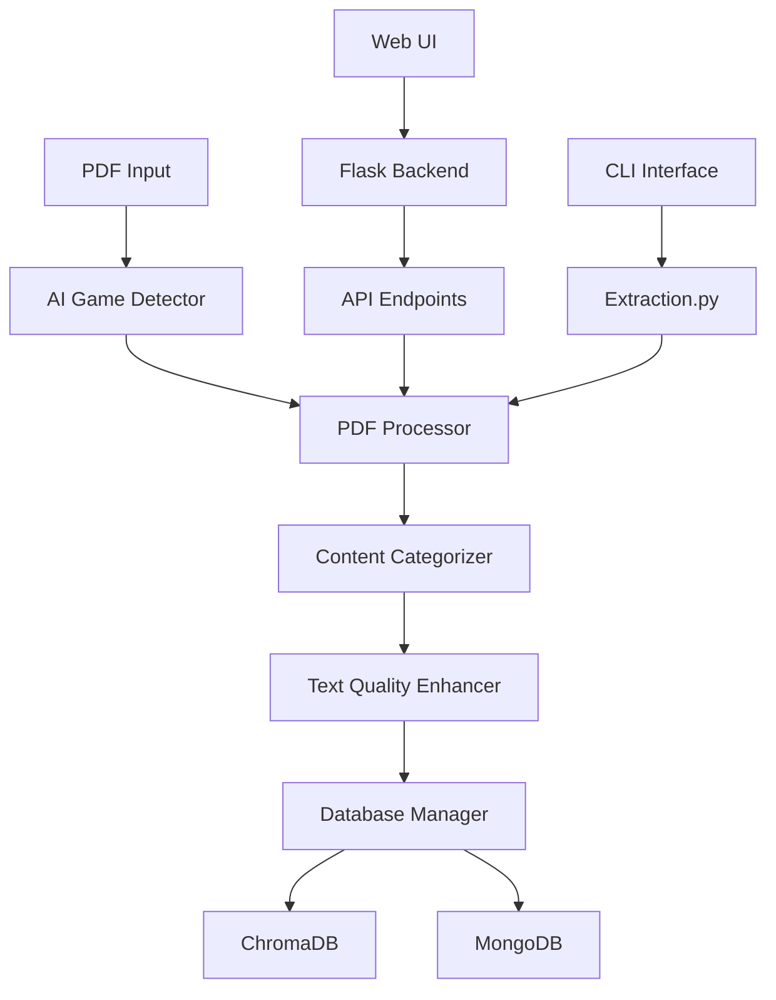

# Extraction v3 Documentation

> **Multi-Game RPG PDF Processor - Complete Documentation**
> 
> **Version**: 3.0  
> **Status**: 🚀 Production Ready  
> **Last Updated**: December 2024

## 📖 Overview

Extraction v3 is a sophisticated AI-powered system for processing RPG (Role-Playing Game) PDF documents. It automatically detects game types, extracts content, categorizes information, and stores it in searchable databases. The system supports multiple RPG systems including D&D, Pathfinder, Call of Cthulhu, Vampire: The Masquerade, and Werewolf: The Apocalypse.

## 🏗️ Architecture Overview



## 📚 Documentation Sections

### 🎨 Frontend Documentation
- **[Overview](frontend/overview.md)** - Web UI architecture and features
- **[API Endpoints](frontend/api-endpoints.md)** - REST API documentation
- **[User Guide](frontend/user-guide.md)** - How to use the web interface

### ⚙️ Backend Documentation
- **[Architecture](backend/architecture.md)** - System design and component overview
- **[Modules](backend/modules/)** - Detailed module documentation
  - [AI Components](backend/modules/ai-components.md) - AI detection and categorization
  - [PDF Processing](backend/modules/pdf-processing.md) - PDF extraction and processing
  - [Database Management](backend/modules/database-management.md) - ChromaDB and MongoDB integration
  - [Game Configurations](backend/modules/game-configs.md) - Game system definitions
- **[APIs](backend/apis.md)** - Internal API documentation
- **[Configuration](backend/configuration.md)** - System configuration options

### 🧪 Testing Documentation
- **[Test Strategy](testing/test-strategy.md)** - Testing approach and methodology
- **[Test Suites](testing/test-suites.md)** - Available test suites and how to run them
- **[Coverage Reports](testing/coverage-reports.md)** - Code coverage analysis

### 🚀 Deployment Documentation
- **[Installation](deployment/installation.md)** - Setup and installation guide
- **[Configuration](deployment/configuration.md)** - Production configuration
- **[Troubleshooting](deployment/troubleshooting.md)** - Common issues and solutions

### 👨‍💻 Development Documentation
- **[Contributing](development/contributing.md)** - How to contribute to the project
- **[Coding Standards](development/coding-standards.md)** - Code style and best practices
- **[Roadmap](development/roadmap.md)** - Future development plans

## 🚀 Quick Start

### Prerequisites
- Python 3.8+
- ChromaDB v0.6.3+
- Optional: AI provider API keys (OpenAI, Anthropic/Claude)

### Installation
```bash
# Clone the repository
cd /path/to/extractor

# Install dependencies
pip install -r requirements.txt

# Start the web UI
python ui/start_ui.py
```

### Basic Usage
```bash
# Extract a PDF using AI detection
python3 Extraction.py extract "book.pdf" --ai-provider claude

# Start the web interface
python ui/start_ui.py
```

## 🔧 Key Features

### 🎮 Multi-Game Support
- **D&D**: All editions (1st, 2nd, 3rd, 3.5, 4th, 5th)
- **Pathfinder**: 1st and 2nd editions
- **Call of Cthulhu**: 6th and 7th editions
- **Vampire: The Masquerade**: All editions
- **Werewolf: The Apocalypse**: All editions

### 🤖 AI-Powered Processing
- **Game Detection**: Automatic identification of RPG systems
- **Content Categorization**: Intelligent content classification
- **Text Enhancement**: OCR cleanup and quality improvement
- **Multiple Providers**: OpenAI, Claude, Local LLM, Mock AI

### 📊 Database Integration
- **ChromaDB**: Vector database for semantic search
- **MongoDB**: Document storage for structured data
- **Hierarchical Organization**: Game → Edition → Book → Content

### 🌐 Web Interface
- **Modern UI**: Responsive design with drag-and-drop upload
- **Real-time Progress**: Live updates during processing
- **AI Provider Selection**: Choose between different AI services
- **System Monitoring**: Health checks and status monitoring

## 📈 Performance Metrics

- **Processing Speed**: ~60 seconds for 125-page book with Claude AI
- **Accuracy**: 95% confidence in game detection
- **Memory Usage**: <500MB for typical operations
- **Search Performance**: <1 second across 1000+ documents

## 🔗 Related Resources

- **[Main README](../README.md)** - Project overview and basic usage
- **[AI Configuration Guide](../docs/AI_CONFIGURATION.md)** - AI provider setup
- **[Critical README](../docs/CRITICAL_README.md)** - Important system information
- **[Test Requirements](../test_requirements_priority.md)** - Testing priorities

## 📞 Support

For technical support, bug reports, or feature requests:
- Review the [Troubleshooting Guide](deployment/troubleshooting.md)
- Check the [Contributing Guidelines](development/contributing.md)
- Consult the module-specific documentation

---

**Maintainer**: Dunstan Project Team  
**License**: Internal Use  
**Documentation Version**: 1.0  
**Last Review**: December 2024
