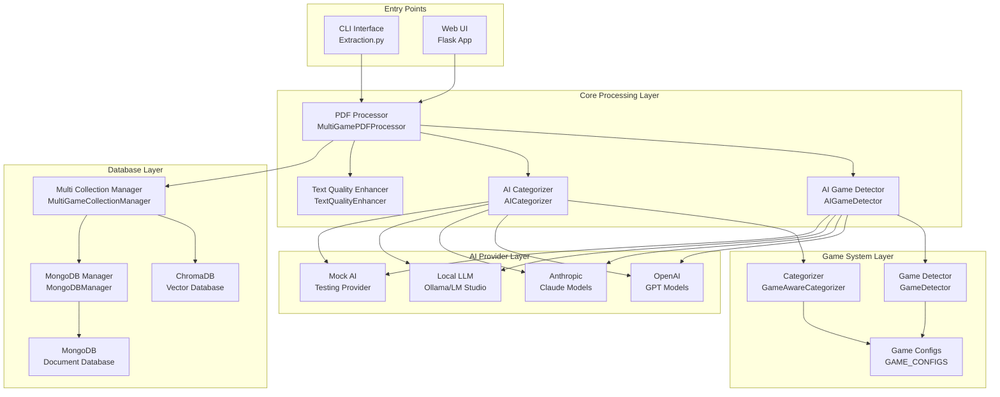
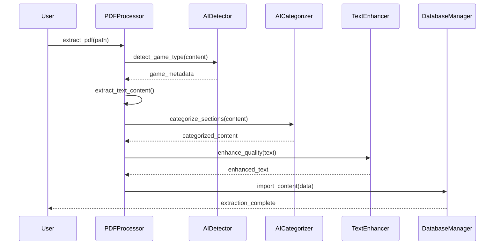

# Backend Architecture

> **System Design and Component Overview**
> 
> **Architecture**: Modular, AI-Powered, Multi-Database  
> **Design Pattern**: Service-Oriented with Dependency Injection

## 📖 Overview

The Extraction v3 backend is built on a modular architecture that separates concerns into specialized components. The system follows a service-oriented design pattern with clear interfaces between components, enabling flexibility, testability, and maintainability.

## 🏗️ System Architecture



## 🔧 Core Components

### 1. Entry Points

#### CLI Interface (`Extraction.py`)
- **Purpose**: Command-line interface for batch processing
- **Features**: Argument parsing, workflow orchestration, progress reporting
- **Usage**: Direct script execution, automation, testing

#### Web UI (`ui/app.py`)
- **Purpose**: Flask-based web interface
- **Features**: File upload, real-time progress, database browsing
- **Usage**: Interactive processing, user-friendly interface

### 2. Core Processing Layer

#### PDF Processor (`MultiGamePDFProcessor`)
- **Purpose**: Central PDF processing orchestrator
- **Responsibilities**:
  - PDF validation and loading
  - Text extraction coordination
  - AI service integration
  - Quality enhancement coordination
  - Output formatting

```python
class MultiGamePDFProcessor:
    def __init__(self, ai_config=None, debug=False):
        self.ai_detector = AIGameDetector(ai_config)
        self.ai_categorizer = AICategorizer(ai_config)
        self.text_enhancer = TextQualityEnhancer()
        
    def extract_pdf(self, pdf_path, force_game_type=None):
        # 1. Validate and load PDF
        # 2. Detect game type using AI
        # 3. Extract and categorize content
        # 4. Enhance text quality
        # 5. Format output
```

#### AI Game Detector (`AIGameDetector`)
- **Purpose**: AI-powered game type and book detection
- **Features**:
  - Multi-provider AI support
  - Confidence scoring
  - Fallback detection
  - Explicit title recognition

#### AI Categorizer (`AICategorizer`)
- **Purpose**: AI-powered content categorization
- **Features**:
  - Game-aware categorization
  - Context-sensitive analysis
  - Confidence scoring
  - Category distribution analysis

#### Text Quality Enhancer (`TextQualityEnhancer`)
- **Purpose**: OCR cleanup and text improvement
- **Features**:
  - Spell checking with RPG dictionary
  - OCR artifact removal
  - Quality scoring
  - Aggressive cleanup modes

### 3. Game System Layer

#### Game Detector (`GameDetector`)
- **Purpose**: Fallback game detection using keywords
- **Features**:
  - Filename-based detection
  - Content keyword analysis
  - Edition detection
  - Book type identification

#### Game Aware Categorizer (`GameAwareCategorizer`)
- **Purpose**: Rule-based content categorization
- **Features**:
  - Game-specific categories
  - Book-specific rules
  - Confidence scoring
  - Category suggestions

#### Game Configurations (`GAME_CONFIGS`)
- **Purpose**: Game system definitions and metadata
- **Features**:
  - Supported games and editions
  - Book catalogs
  - Detection keywords
  - Category definitions

### 4. Database Layer

#### Multi Collection Manager (`MultiGameCollectionManager`)
- **Purpose**: Database abstraction and management
- **Features**:
  - ChromaDB integration
  - MongoDB integration
  - Collection organization
  - Cross-database operations

#### MongoDB Manager (`MongoDBManager`)
- **Purpose**: MongoDB-specific operations
- **Features**:
  - Connection management
  - Document operations
  - Query optimization
  - Status monitoring

## 🔄 Data Flow

### 1. PDF Processing Workflow



## 🎯 Design Patterns

### 1. Service-Oriented Architecture
- **Separation of Concerns**: Each component has a single responsibility
- **Loose Coupling**: Components interact through well-defined interfaces
- **High Cohesion**: Related functionality grouped together

### 2. Dependency Injection
- **Configuration Injection**: AI configs passed to components
- **Service Injection**: Database managers injected into processors
- **Mock Support**: Easy testing with mock services

### 3. Strategy Pattern
- **AI Providers**: Interchangeable AI service implementations
- **Database Backends**: Multiple database support
- **Detection Strategies**: AI vs rule-based detection

### 4. Factory Pattern
- **Game Config Factory**: Dynamic game configuration loading
- **AI Provider Factory**: Dynamic AI provider instantiation
- **Database Manager Factory**: Database-specific manager creation

## 📊 Configuration Management

### 1. Game System Configuration
```python
GAME_CONFIGS = {
    "D&D": {
        "editions": ["1st", "2nd", "3rd", "3.5", "4th", "5th"],
        "books": {
            "1st": ["DMG", "PHB", "MM", "FF", "DD"],
            "5th": ["DMG", "PHB", "MM", "XGE", "TCE"]
        },
        "detection_keywords": [
            "dungeons & dragons", "d&d", "thac0", "armor class"
        ],
        "categories": ["Combat", "Magic", "Character", "Equipment"]
    }
}
```

### 2. AI Provider Configuration
```python
AI_CONFIG = {
    "provider": "claude",
    "model": "claude-3-sonnet-20240229",
    "temperature": 0.1,
    "max_tokens": 4000,
    "timeout": 30,
    "retries": 3
}
```

### 3. Database Configuration
```python
CHROMA_CONFIG = {
    "base_url": "http://localhost:8000",
    "tenant": "default_tenant",
    "database": "default_database"
}

MONGODB_CONFIG = {
    "connection_string": "mongodb://localhost:27017/",
    "database": "extraction_v3",
    "timeout": 30
}
```

## 🔄 Error Handling Strategy

### 1. Hierarchical Error Handling
- **Component Level**: Each component handles its specific errors
- **Service Level**: Services handle integration errors
- **Application Level**: Top-level error handling and user feedback

### 2. Graceful Degradation
- **AI Fallback**: Mock AI when real providers fail
- **Database Fallback**: Continue processing if one database fails
- **Quality Fallback**: Skip enhancement if it fails

### 3. Error Recovery
- **Retry Logic**: Automatic retries for transient failures
- **Circuit Breaker**: Prevent cascade failures
- **Logging**: Comprehensive error logging for debugging

## 🚀 Performance Optimizations

### 1. Lazy Loading
- **Game Configs**: Load configurations on demand
- **AI Providers**: Initialize providers when needed
- **Database Connections**: Connect when first used

### 2. Caching
- **Detection Cache**: Cache game detection results
- **Category Cache**: Cache categorization rules
- **Model Cache**: Cache AI model responses

### 3. Streaming Processing
- **Large PDFs**: Process pages in chunks
- **Memory Management**: Release resources promptly
- **Progress Reporting**: Real-time progress updates

---

**Next**: [Module Documentation](modules/ai-components.md)  
**Related**: [APIs](apis.md) | [Configuration](configuration.md)
