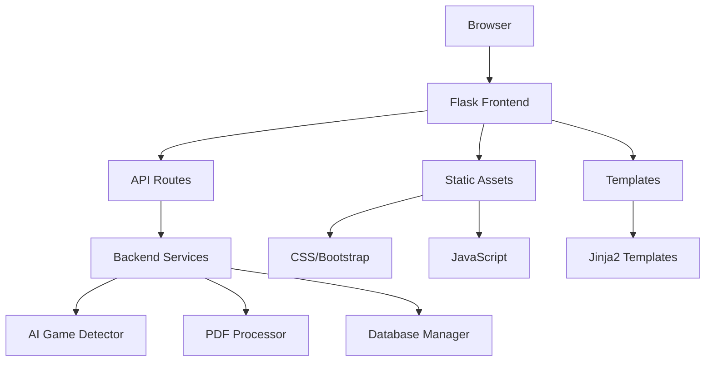

# Frontend Overview

> **Web UI Architecture and Features**
> 
> **Technology Stack**: Flask + Bootstrap + JavaScript  
> **Status**: 🚀 Production Ready

## 📖 Overview

The Extraction v3 Web UI provides a modern, user-friendly interface for PDF analysis and extraction. Built with Flask backend and responsive frontend technologies, it offers real-time processing updates, AI provider selection, and comprehensive system monitoring.

## 🏗️ Architecture



## 📁 File Structure

```
ui/
├── app.py                 # Main Flask application
├── start_ui.py           # Application launcher
├── launch.sh             # Shell script launcher
├── requirements.txt      # UI-specific dependencies
├── README.md            # UI documentation
├── static/              # Static assets
│   ├── css/
│   │   └── style.css    # Custom styles
│   └── js/
│       └── app.js       # Frontend JavaScript
└── templates/           # Jinja2 templates
    └── index.html       # Main UI template
```

## 🎨 User Interface Components

### 📤 File Upload Section
- **Drag & Drop**: Modern file upload with visual feedback
- **File Validation**: PDF format and size validation (200MB limit)
- **Progress Indication**: Upload progress with percentage
- **Error Handling**: Clear error messages for invalid files

### 🤖 AI Provider Selection
- **Multiple Providers**: Claude, OpenAI, Local LLM, Mock AI
- **Model Selection**: Choose specific AI models
- **Configuration**: Temperature, max tokens, timeout settings
- **Status Indicators**: Real-time provider availability

### 📊 Analysis Dashboard
- **Game Detection**: Display detected game type, edition, book
- **Confidence Scores**: AI confidence levels with visual indicators
- **Content Preview**: Sample extracted content
- **Metadata Display**: File information and processing details

### ⚙️ Extraction Controls
- **Processing Options**: Quality enhancement settings
- **Real-time Progress**: Step-by-step progress tracking
- **Category Distribution**: Visual breakdown of content types
- **Statistics**: Pages, words, sections count

### 💾 Database Integration
- **ChromaDB Import**: One-click vector database import
- **MongoDB Support**: Document database integration
- **Download Options**: Export results as JSON
- **Import Status**: Success/error feedback with details

### 📈 System Monitoring
- **Health Checks**: Database and AI provider status
- **Active Sessions**: Current processing sessions
- **Performance Metrics**: Processing times and statistics
- **Version Information**: System version and build details

## 🔧 Technical Features

### 🌐 Responsive Design
- **Mobile-First**: Optimized for mobile devices
- **Bootstrap Framework**: Consistent UI components
- **Adaptive Layout**: Works on desktop, tablet, mobile
- **Touch-Friendly**: Optimized for touch interactions

### ⚡ Real-time Updates
- **WebSocket Support**: Live progress updates
- **AJAX Requests**: Asynchronous data loading
- **Progress Bars**: Visual progress indication
- **Status Polling**: Automatic status refresh

### 🔒 Security Features
- **File Validation**: Strict file type checking
- **Size Limits**: 200MB maximum file size
- **Secure Uploads**: Werkzeug secure filename handling
- **Session Management**: Secure session handling

### 📱 Accessibility
- **ARIA Labels**: Screen reader support
- **Keyboard Navigation**: Full keyboard accessibility
- **High Contrast**: Accessible color schemes
- **Focus Management**: Proper focus handling

## 🚀 Performance Optimizations

### ⚡ Frontend Performance
- **Asset Minification**: Compressed CSS and JavaScript
- **Caching Strategy**: Appropriate cache headers
- **Lazy Loading**: On-demand content loading
- **Compression**: Gzip compression for static assets

### 🔄 Backend Efficiency
- **Async Processing**: Non-blocking file processing
- **Memory Management**: Efficient file handling
- **Connection Pooling**: Database connection optimization
- **Error Recovery**: Graceful error handling

## 🎯 User Experience Features

### 📋 Workflow Management
1. **Upload**: Drag-and-drop or browse for PDF files
2. **Configure**: Select AI provider and processing options
3. **Analyze**: AI-powered game detection and analysis
4. **Extract**: Content extraction with real-time progress
5. **Import**: Database import with status feedback
6. **Download**: Export results for external use

### 🔍 Search and Discovery
- **Quick Search**: Find specific content across extractions
- **Filter Options**: Filter by game type, edition, category
- **Sort Controls**: Sort results by relevance, date, confidence
- **Export Options**: Download filtered results

### 📊 Data Visualization
- **Progress Charts**: Visual progress tracking
- **Confidence Meters**: AI confidence visualization
- **Category Pie Charts**: Content distribution charts
- **Statistics Panels**: Key metrics display

## 🛠️ Configuration Options

### 🤖 AI Provider Settings
```javascript
{
  "provider": "claude|openai|local|mock",
  "model": "claude-3-sonnet-20240229",
  "temperature": 0.1,
  "max_tokens": 4000,
  "timeout": 30
}
```

### 📁 Upload Settings
```javascript
{
  "max_file_size": "200MB",
  "allowed_extensions": ["pdf"],
  "upload_timeout": 300,
  "chunk_size": "1MB"
}
```

### 🎨 UI Customization
```css
:root {
  --primary-color: #007bff;
  --success-color: #28a745;
  --warning-color: #ffc107;
  --danger-color: #dc3545;
}
```

## 🔗 Integration Points

### 📡 API Endpoints
- **`/api/analyze`**: PDF analysis endpoint
- **`/api/extract`**: Content extraction endpoint
- **`/api/import`**: Database import endpoint
- **`/api/status`**: System status endpoint

### 🗄️ Database Connections
- **ChromaDB**: Vector database integration
- **MongoDB**: Document database integration
- **Session Storage**: Temporary result storage

### 🤖 AI Services
- **OpenAI API**: GPT model integration
- **Anthropic API**: Claude model integration
- **Local LLM**: Ollama/LM Studio integration
- **Mock AI**: Testing and fallback service

## 📈 Monitoring and Analytics

### 📊 Usage Metrics
- **Upload Statistics**: File sizes, types, success rates
- **Processing Times**: Analysis and extraction durations
- **AI Provider Usage**: Provider selection and performance
- **Error Rates**: Failed uploads and processing errors

### 🔍 Performance Monitoring
- **Response Times**: API endpoint performance
- **Memory Usage**: Frontend and backend memory consumption
- **Database Performance**: Query times and connection health
- **User Experience**: Page load times and interaction metrics

## 🚀 Future Enhancements

### 🎯 Planned Features
- **Batch Upload**: Multiple file upload support
- **Advanced Search**: Full-text search across all content
- **User Accounts**: Multi-user support with authentication
- **API Documentation**: Interactive API documentation

### 🔧 Technical Improvements
- **WebSocket Integration**: Real-time bidirectional communication
- **Progressive Web App**: Offline capability and app-like experience
- **Advanced Caching**: Redis-based caching for improved performance
- **Microservices**: Service-oriented architecture migration

---

**Next**: [API Endpoints Documentation](api-endpoints.md)  
**Related**: [User Guide](user-guide.md) | [Backend Architecture](../backend/architecture.md)
