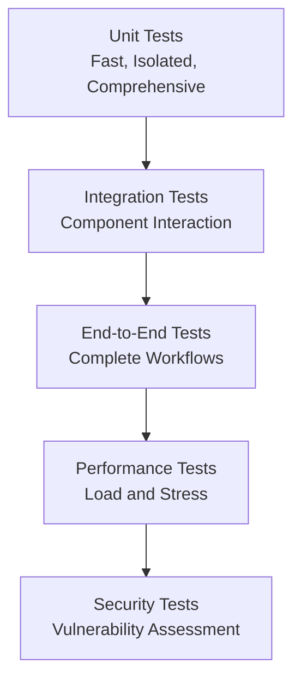

# Testing Strategy

> **Comprehensive Testing Approach for Extraction v3**
> 
> **Framework**: pytest with coverage reporting  
> **Approach**: Priority-based, incremental testing

## 📖 Overview

The Extraction v3 testing strategy follows a priority-based approach, focusing on critical core functionality first, then expanding to integration tests and advanced features. The strategy emphasizes reliability, maintainability, and comprehensive coverage of the AI-powered processing pipeline.

## 🎯 Testing Philosophy

### 1. Priority-Driven Testing
- **Priority 1**: Critical core functionality that everything depends on
- **Priority 2**: Essential integration and workflow testing
- **Priority 3**: Advanced features and optimization testing
- **Priority 4-6**: Specialized and edge case testing

### 2. Test Pyramid Structure


### 3. AI-Aware Testing
- **Mock AI Providers**: Reliable testing without API dependencies
- **Confidence Testing**: Validate AI confidence scoring
- **Fallback Testing**: Ensure graceful degradation
- **Provider Switching**: Test multiple AI provider integrations

## 🏗️ Test Architecture

### Test Organization
```
tests/
├── unit/                    # Unit tests for individual components
│   ├── test_pdf_processor.py
│   ├── test_ai_game_detector.py
│   ├── test_ai_categorizer.py
│   ├── test_text_quality_enhancer.py
│   ├── test_mongodb_manager.py
│   └── test_game_configs.py
├── integration/             # Integration tests
│   ├── test_e2e_extraction.py
│   ├── test_ai_pipeline.py
│   ├── test_database_integration.py
│   └── test_web_ui.py
├── performance/             # Performance and load tests
│   ├── test_processing_speed.py
│   ├── test_memory_usage.py
│   └── test_concurrent_processing.py
├── fixtures/                # Test data and fixtures
│   ├── sample_pdfs/
│   ├── mock_responses/
│   └── test_configs/
└── conftest.py             # Pytest configuration and fixtures
```

## 🔧 Priority 1: Critical Core Functionality

### 1.1 PDF Processing Tests (`test_pdf_processor.py`)

#### PDF Reading & Validation
```python
def test_pdf_file_opening():
    """Test PDF file opening with valid/invalid files"""
    # Valid PDF
    processor = MultiGamePDFProcessor()
    result = processor.extract_pdf(valid_pdf_path)
    assert result is not None
    
    # Invalid file
    with pytest.raises(FileNotFoundError):
        processor.extract_pdf(nonexistent_path)
    
    # Corrupted PDF
    with pytest.raises(Exception):
        processor.extract_pdf(corrupted_pdf_path)

def test_large_file_handling():
    """Test memory management with large PDFs"""
    processor = MultiGamePDFProcessor()
    result = processor.extract_pdf(large_pdf_path)
    
    # Check memory usage doesn't exceed threshold
    import psutil
    process = psutil.Process()
    memory_mb = process.memory_info().rss / 1024 / 1024
    assert memory_mb < 1000  # Less than 1GB
```

#### Content Extraction
```python
def test_text_extraction_types():
    """Test extraction from different PDF types"""
    processor = MultiGamePDFProcessor()
    
    # Text-based PDF
    text_result = processor.extract_pdf(text_based_pdf)
    assert len(text_result["sections"]) > 0
    assert text_result["total_words"] > 1000
    
    # Scanned PDF (OCR required)
    scanned_result = processor.extract_pdf(scanned_pdf)
    assert len(scanned_result["sections"]) > 0
    # May have lower word count due to OCR quality

def test_metadata_extraction():
    """Test PDF metadata extraction"""
    processor = MultiGamePDFProcessor()
    result = processor.extract_pdf(metadata_rich_pdf)
    
    metadata = result["pdf_metadata"]
    assert "title" in metadata
    assert "author" in metadata
    assert "subject" in metadata
```

### 1.2 AI Game Detection Tests (`test_ai_game_detector.py`)

#### Game Type Detection
```python
@pytest.mark.parametrize("game_type,pdf_path,expected_confidence", [
    ("D&D", "dnd_1st_phb.pdf", 0.8),
    ("Pathfinder", "pathfinder_core.pdf", 0.8),
    ("Call of Cthulhu", "coc_keeper.pdf", 0.8),
])
def test_game_detection_accuracy(game_type, pdf_path, expected_confidence):
    """Test detection accuracy for each supported game system"""
    detector = AIGameDetector({"provider": "mock"})
    result = detector.analyze_game_metadata(pdf_path)
    
    assert result["game_type"] == game_type
    assert result["confidence"] >= expected_confidence

def test_confidence_scoring():
    """Test confidence scoring for different content types"""
    detector = AIGameDetector({"provider": "mock"})
    
    # High confidence case
    clear_result = detector.analyze_game_metadata(clear_dnd_pdf)
    assert clear_result["confidence"] > 0.8
    
    # Low confidence case
    ambiguous_result = detector.analyze_game_metadata(ambiguous_pdf)
    assert ambiguous_result["confidence"] < 0.6
```

#### AI Provider Integration
```python
def test_ai_provider_fallback():
    """Test fallback mechanisms when AI fails"""
    # Test with invalid API key
    config = {"provider": "openai", "api_key": "invalid"}
    detector = AIGameDetector(config)
    
    result = detector.analyze_game_metadata(test_pdf)
    # Should fallback to mock AI
    assert result is not None
    assert "game_type" in result

@pytest.mark.integration
def test_real_ai_providers():
    """Test real AI provider integration (requires API keys)"""
    if not os.getenv("ANTHROPIC_API_KEY"):
        pytest.skip("ANTHROPIC_API_KEY not set")
    
    detector = AIGameDetector({"provider": "claude"})
    result = detector.analyze_game_metadata(test_pdf)
    
    assert result["confidence"] > 0.5
    assert result["game_type"] in SUPPORTED_GAMES
```

## 🔗 Priority 2: Essential Integration & Workflow

### 2.1 End-to-End Extraction Tests (`test_e2e_extraction.py`)

#### Complete Workflow
```python
def test_full_extraction_workflow():
    """Test complete PDF → Analysis → Extraction → Database workflow"""
    # Initialize components
    processor = MultiGamePDFProcessor(ai_config={"provider": "mock"})
    
    # Extract PDF
    result = processor.extract_pdf(test_pdf_path)
    
    # Validate extraction
    assert "game_metadata" in result
    assert "sections" in result
    assert len(result["sections"]) > 0
    
    # Test database import
    manager = MultiGameCollectionManager()
    import_result = manager.import_extraction_data(result)
    assert import_result["success"]

def test_different_content_types():
    """Test various game systems and editions"""
    processor = MultiGamePDFProcessor(ai_config={"provider": "mock"})
    
    test_cases = [
        ("dnd_1st_phb.pdf", "D&D", "1st"),
        ("pathfinder_core.pdf", "Pathfinder", "1st"),
        ("coc_keeper.pdf", "Call of Cthulhu", "7th")
    ]
    
    for pdf_path, expected_game, expected_edition in test_cases:
        result = processor.extract_pdf(pdf_path)
        assert result["game_metadata"]["game_type"] == expected_game
        assert result["game_metadata"]["edition"] == expected_edition
```

### 2.2 Flask Application Tests (`test_web_ui.py`)

#### File Upload Tests
```python
def test_file_upload_validation(client):
    """Test PDF file upload validation"""
    # Valid PDF upload
    with open(test_pdf_path, 'rb') as f:
        response = client.post('/upload', data={'file': f})
    assert response.status_code == 200
    
    # Invalid file type
    with open('test.txt', 'rb') as f:
        response = client.post('/upload', data={'file': f})
    assert response.status_code == 400
    assert "Only PDF files are allowed" in response.json["error"]

def test_file_size_limits(client):
    """Test file size limits (200MB)"""
    # Create oversized file mock
    large_file = io.BytesIO(b'x' * (201 * 1024 * 1024))  # 201MB
    response = client.post('/upload', data={'file': large_file})
    assert response.status_code == 413  # Payload Too Large
```

## 🧪 Test Infrastructure

### Fixtures and Test Data
```python
# conftest.py
@pytest.fixture
def test_pdf_path():
    """Provide path to test PDF file"""
    return Path("tests/fixtures/sample_pdfs/dnd_1st_phb_sample.pdf")

@pytest.fixture
def mock_ai_config():
    """Provide mock AI configuration"""
    return {"provider": "mock", "debug": True}

@pytest.fixture
def mongodb_test_config():
    """Provide test MongoDB configuration"""
    return {
        "connection_string": "mongodb://localhost:27017/",
        "database": "test_extraction_v3"
    }

@pytest.fixture(scope="session")
def flask_app():
    """Create Flask app for testing"""
    from ui.app import app
    app.config['TESTING'] = True
    return app
```

### Mock Services
```python
class MockAIProvider:
    """Mock AI provider for consistent testing"""
    
    def analyze(self, prompt: str) -> Dict[str, Any]:
        return {
            "game_type": "D&D",
            "edition": "1st",
            "book_type": "PHB",
            "confidence": 0.85,
            "reasoning": "Mock analysis for testing"
        }

class MockDatabase:
    """Mock database for testing without real DB"""
    
    def __init__(self):
        self.collections = {}
    
    def create_collection(self, name: str):
        self.collections[name] = []
        return {"success": True}
    
    def insert_document(self, collection: str, doc: Dict):
        if collection not in self.collections:
            self.collections[collection] = []
        self.collections[collection].append(doc)
        return {"success": True}
```

## 📊 Coverage and Quality Metrics

### Coverage Targets
- **Unit Tests**: >90% code coverage
- **Integration Tests**: >80% workflow coverage
- **Critical Paths**: 100% coverage for core functionality

### Quality Gates
```python
# pytest.ini
[tool:pytest]
addopts = 
    --cov=Modules
    --cov=ui
    --cov-report=html
    --cov-report=term-missing
    --cov-fail-under=80
    --strict-markers
    --disable-warnings
```

### Test Execution
```bash
# Run all tests
pytest

# Run specific test category
pytest tests/unit/
pytest tests/integration/

# Run with coverage
pytest --cov=Modules --cov-report=html

# Run performance tests
pytest tests/performance/ -m performance
```

## 🎯 Success Metrics

### Test Quality Indicators
1. **Coverage**: >80% overall, >90% for critical components
2. **Speed**: Unit tests <5 minutes, full suite <15 minutes
3. **Reliability**: <1% flaky test rate
4. **Maintainability**: Clear test names and documentation

### Performance Benchmarks
1. **PDF Processing**: <2 minutes for 100-page PDF
2. **AI Analysis**: <30 seconds for game detection
3. **Database Import**: <1 minute for 1000 documents
4. **Memory Usage**: <1GB peak memory for large PDFs

---

**Next**: [Test Suites Documentation](test-suites.md)  
**Related**: [Coverage Reports](coverage-reports.md) | [Backend Architecture](../backend/architecture.md)
